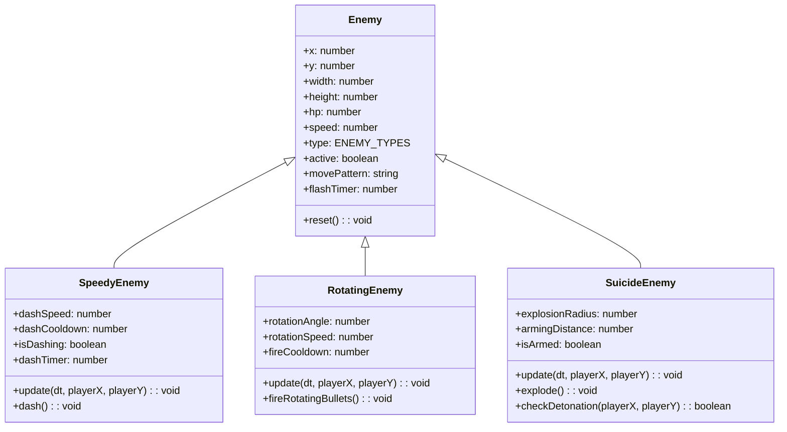
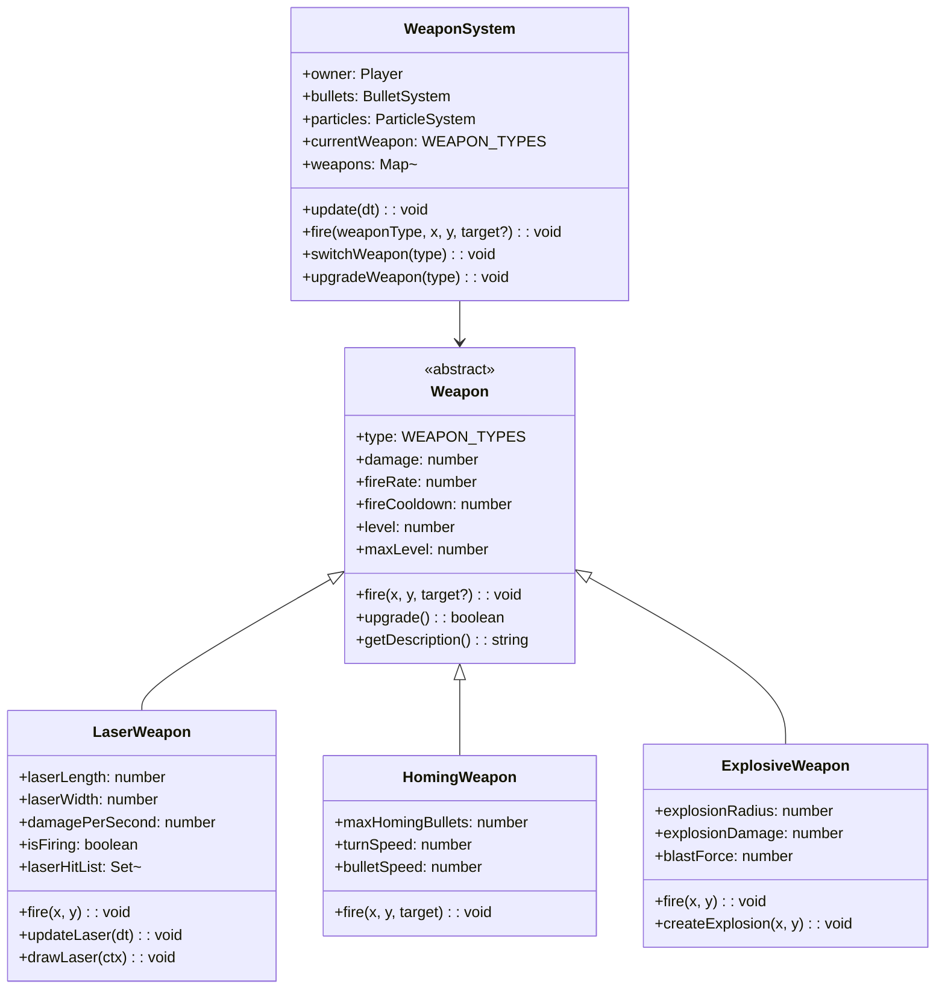
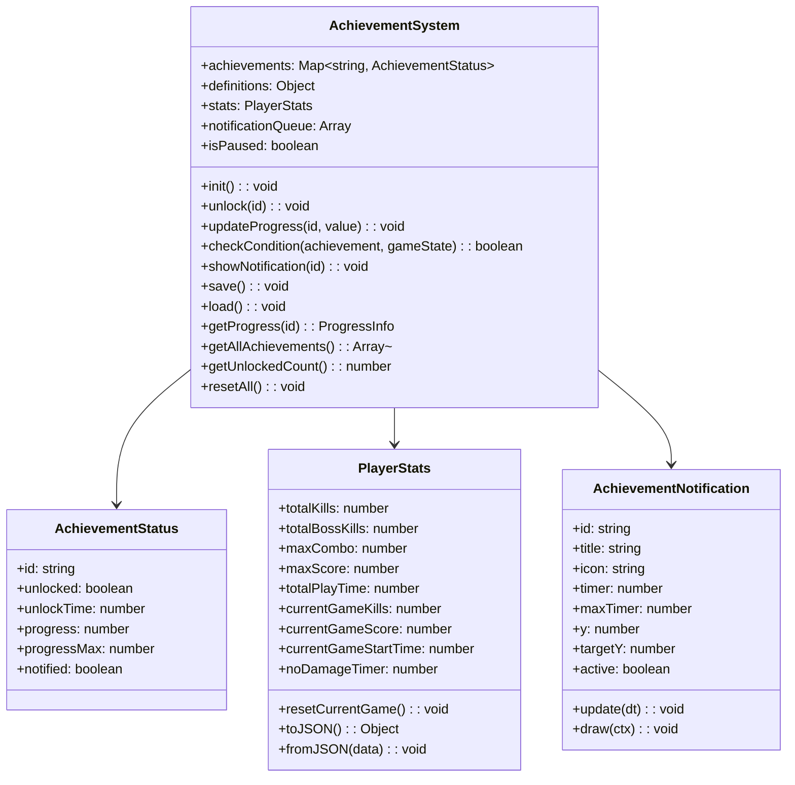
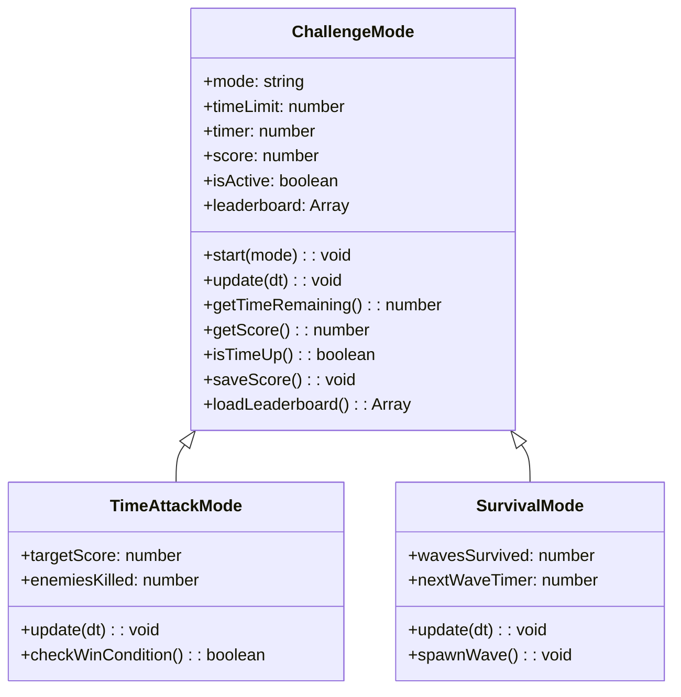
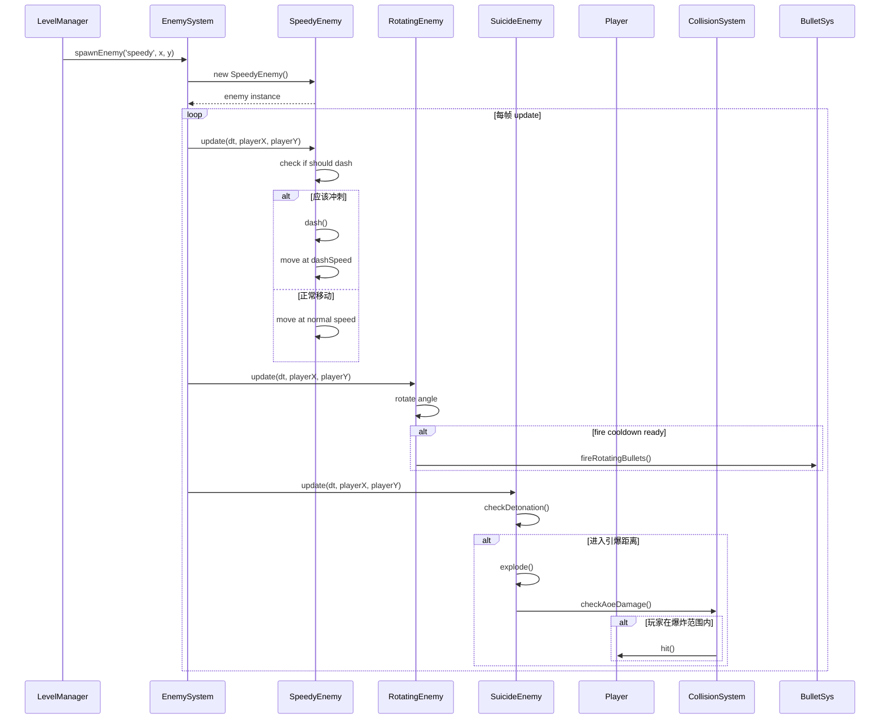
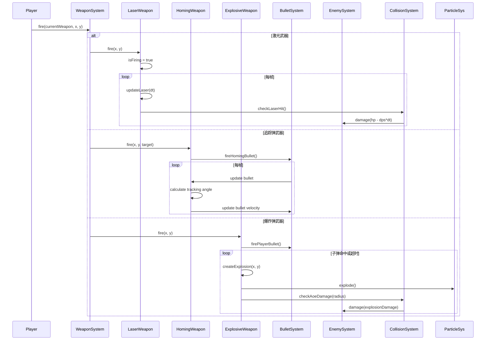
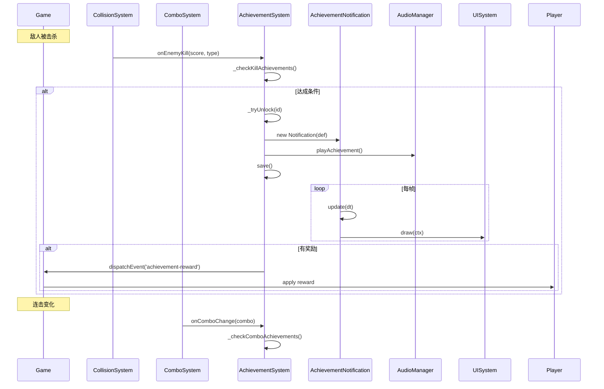

# Raiden Storm 游戏增强版 - 系统架构设计文档

> **版本**: v1.0  
> **日期**: 2024-05-15  
> **架构师**: Bob (Software Architect)  
> **项目**: Raiden Storm - HTML5 Canvas 竖版射击游戏增强方案

---

## 1. 实现方案 + 框架选型

### 1.1 技术难点分析

| 难点 | 挑战 | 解决方案 |
|------|------|----------|
| 新敌人 AI | 高速移动 + 自爆逻辑需要精确碰撞检测 | 扩展现有 `rectCollision`，增加 `circleCollision` 用于爆炸范围 |
| Boss 新攻击模式 | 弹幕模式需要大量子弹对象池管理 | 复用现有 `ObjectPool`，优化子弹生命周期管理 |
| 激光武器 | 持续伤害需要每帧检测而非单次碰撞 | 新增 `laser` 类型子弹，在 `update` 中持续检测 |
| 成就系统 | 20+ 成就的事件监听和持久化存储 | 中央事件分发 + LocalStorage 存储 |
| 动态音乐 | 根据战斗强度切换音乐 | 扩展现有 Web Audio API 音乐系统，增加 intensity 参数 |

### 1.2 框架选型

**决策：保持现有架构，不引入新框架**

- ✅ **HTML5 Canvas** - 继续使用，性能满足需求
- ✅ **原生 ES Modules** - 无打包工具，保持简单
- ✅ **Web Audio API** - 程序化音频，无需外部音频库
- ❌ **不引入物理引擎** - 游戏结构简单，自定义物理足够
- ❌ **不引入动画库** - 粒子系统已自研，满足需求

**新增可选依赖（零或极少）**：
- 无强制依赖
- 可选：`howler.js` (音频兼容性问题时的 fallback)

### 1.3 架构模式

```
┌─────────────────────────────────────────────┐
│              Game (main.js)                │
│        主循环 + 状态管理                    │
└──────────┬──────────────────────────────┘
           │ 组合(Composition)
    ┌──────┴──────────────────────────────┐
    │          Systems (系统层)              │
    │  Player │ EnemySystem │ Boss         │
    │  BulletSystem │ PowerUpSystem       │
    │  CollisionSystem │ ParticleSystem    │
    │  AudioManager │ UISystem            │
    │  ComboSystem │ FloatingTextSystem  │
    │  [新增] AchievementSystem           │
    │  [新增] ChallengeMode             │
    └─────────────────────────────────────┘
```

---

## 2. 文件列表及相对路径

### 2.1 现有文件（修改）

| 文件路径 | 修改内容 |
|----------|----------|
| `js/main.js` | 引入新系统（Achievement, Challenge），更新 `_update()` 和 `_draw()` |
| `js/enemies.js` | 新增 3 种敌人类型类，扩展 `ENEMY_TYPES` 枚举 |
| `js/boss.js` | 为 3 个 Boss 各新增 2-3 种攻击模式 |
| `js/bullets.js` | 新增激光、追踪弹、爆炸弹子弹类型 |
| `js/player.js` | 新增武器系统（激光、追踪、爆炸），新道具效果处理 |
| `js/powerups.js` | 新增 4 种道具类型，扩展 `POWERUP_TYPES` |
| `js/collision.js` | 新增激光持续伤害检测，自爆敌人碰撞处理 |
| `js/particles.js` | 增强爆炸效果，新增背景动态元素粒子 |
| `js/audio.js` | 新增音效，动态音乐强度切换 |
| `js/ui.js` | 新增成就通知、挑战模式 HUD、皮肤选择界面 |
| `js/levels.js` | 新增挑战模式关卡配置 |
| `js/combo.js` | 与成就系统联动（连击里程碑） |
| `js/utils.js` | 新增工具函数（`lerp`, `clamp`, 对象池优化） |

### 2.2 新增文件

| 文件路径 | 功能描述 |
|----------|----------|
| `js/achievements.js` | 成就系统（详细设计见第 3 节） |
| `js/challenge.js` | 挑战模式（限时/生存） |
| `js/weapons.js` | 新武器系统（激光、追踪弹、爆炸弹） |
| `js/background.js` | 背景动态元素（漂浮云/陨石） |
| `js/skins.js` | 飞机皮肤系统（P2 功能，预留接口） |
| `css/achievements.css` | 成就通知样式（可选，内联样式也可） |

### 2.3 文件组织架构

```
raiden/
├── index.html
├── css/
│   └── style.css
├── js/
│   ├── main.js                 # 游戏入口
│   ├── player.js               # 玩家系统
│   ├── enemies.js              # 敌人系统（修改）
│   ├── boss.js                 # Boss 系统（修改）
│   ├── bullets.js              # 子弹系统（修改）
│   ├── weapons.js              # [新增] 武器系统
│   ├── powerups.js             # 道具系统（修改）
│   ├── levels.js               # 关卡系统（修改）
│   ├── collision.js            # 碰撞系统（修改）
│   ├── particles.js            # 粒子系统（修改）
│   ├── audio.js                # 音频系统（修改）
│   ├── ui.js                   # UI 系统（修改）
│   ├── combo.js                # 连击系统（修改）
│   ├── floatingText.js         # 浮动文字（修改）
│   ├── input.js                # 输入系统
│   ├── background.js           # [新增] 背景动态
│   ├── achievements.js         # [新增] 成就系统
│   ├── challenge.js            # [新增] 挑战模式
│   ├── skins.js                # [新增] 皮肤系统（P2）
│   └── utils.js                # 工具函数（修改）
└── docs/
    ├── system_design.md        # 本文档
    ├── class-diagram.mermaid  # 类图
    └── sequence-diagram.mermaid # 时序图
```

---

## 3. 数据结构和接口（类图）

### 3.1 新敌人类型设计



### 3.2 新武器系统设计



### 3.3 成就系统（核心详细设计）

> **要求：必须详细到可直接指导工程师实现**

#### 3.3.1 成就数据结构

```javascript
// js/achievements.js

/**
 * 成就定义接口（常量配置）
 */
const ACHIEVEMENT_DEFS = {
    // --- 击杀类成就 ---
    FIRST_BLOOD: {
        id: 'FIRST_BLOOD',
        title: '初次见血',
        description: '击破第一架敌机',
        icon: '🎯',
        category: 'kill',
        condition: { type: 'total_kills', value: 1 },
        reward: { type: 'score', value: 100 },
        hidden: false
    },
    MASSACRE: {
        id: 'MASSACRE',
        title: '大屠杀',
        description: '单局击破 100 架敌机',
        icon: '🔥',
        category: 'kill',
        condition: { type: 'single_game_kills', value: 100 },
        reward: { type: 'bomb', value: 1 },
        hidden: false
    },
    BOSS_HUNTER: {
        id: 'BOSS_HUNTER',
        title: 'Boss 猎人',
        description: '击破 5 个 Boss',
        icon: '👹',
        category: 'kill',
        condition: { type: 'total_boss_kills', value: 5 },
        reward: { type: 'life', value: 1 },
        hidden: false
    },
    
    // --- 连击类成就 ---
    COMBO_10: {
        id: 'COMBO_10',
        title: '连击新手',
        description: '达成 10 连击',
        icon: '⚡',
        category: 'combo',
        condition: { type: 'max_combo', value: 10 },
        reward: { type: 'score', value: 500 },
        hidden: false
    },
    COMBO_50: {
        id: 'COMBO_50',
        title: '连击大师',
        description: '达成 50 连击',
        icon: '🌟',
        category: 'combo',
        condition: { type: 'max_combo', value: 50 },
        reward: { type: 'weapon_upgrade', value: 1 },
        hidden: false
    },
    
    // --- 分数类成就 ---
    SCORE_10K: {
        id: 'SCORE_10K',
        title: '万元户',
        description: '单局得分达到 10,000',
        icon: '💰',
        category: 'score',
        condition: { type: 'single_game_score', value: 10000 },
        reward: { type: 'score', value: 1000 },
        hidden: false
    },
    
    // --- 生存类成就 ---
    SURVIVE_5MIN: {
        id: 'SURVIVE_5MIN',
        title: '坚韧不拔',
        description: '生存超过 5 分钟',
        icon: '⏱️',
        category: 'survival',
        condition: { type: 'survival_time', value: 300 },
        reward: { type: 'shield', value: 1 },
        hidden: false
    },
    
    // --- 完美类成就 ---
    NO_HIT_1MIN: {
        id: 'NO_HIT_1MIN',
        title: '无伤达人',
        description: '1 分钟内不受伤害',
        icon: '🛡️',
        category: 'perfection',
        condition: { type: 'no_damage_time', value: 60 },
        reward: { type: 'score', value: 2000 },
        hidden: false
    },
    
    // --- 探索类成就（隐藏） ---
    SECRET_SPEED_RUN: {
        id: 'SECRET_SPEED_RUN',
        title: '速通传说',
        description: '在 2 分钟内完成第 1 关',
        icon: '💎',
        category: 'exploration',
        condition: { type: 'level_clear_time', level: 1, value: 120 },
        reward: { type: 'unlock_skin', value: 'skin_01' },
        hidden: true
    }
    
    // ... 总计 20+ 成就定义
};

/**
 * 玩家成就进度存储结构（LocalStorage）
 */
// LocalStorage Key: 'raiden_achievements'
// Value Structure:
// {
//     "version": 1,
//     "unlocked": ["FIRST_BLOOD", "COMBO_10", ...],
//     "progress": {
//         "MASSACRE": { "current": 45, "max": 100 },
//         "COMBO_50": { "current": 23, "max": 50 }
//     },
//     "stats": {
//         "total_games": 15,
//         "total_kills": 1234,
//         "total_boss_kills": 8,
//         "max_combo_ever": 67,
//         "max_score_ever": 45000,
//         "total_playtime": 3600
//     },
//     "last_updated": 1715702400000
// }
```

#### 3.3.2 成就系统核心类设计



#### 3.3.3 成就系统类完整代码骨架

```javascript
// js/achievements.js

import { GAME_WIDTH, GAME_HEIGHT } from './utils.js';

/**
 * 成就状态类 - 跟踪单个成就的解锁进度
 */
export class AchievementStatus {
    constructor(id, def) {
        this.id = id;
        this.def = def;                 // 指向 ACHIEVEMENT_DEFS 中的定义
        this.unlocked = false;           // 是否已解锁
        this.unlockTime = 0;           // 解锁时间戳
        this.progress = 0;             // 当前进度值
        this.progressMax = def.condition.value || 0;
        this.notified = false;          // 是否已显示通知
    }

    updateProgress(value) {
        if (this.unlocked) return false;
        this.progress = Math.max(this.progress, value);
        return this.checkComplete();
    }

    checkComplete() {
        if (this.unlocked) return false;
        const completed = this.progress >= this.progressMax;
        if (completed) {
            this.unlocked = true;
            this.unlockTime = Date.now();
        }
        return completed;
    }

    getProgressRatio() {
        if (this.progressMax === 0) return 1;
        return Math.min(1, this.progress / this.progressMax);
    }

    toJSON() {
        return {
            id: this.id,
            unlocked: this.unlocked,
            unlockTime: this.unlockTime,
            progress: this.progress
        };
    }

    fromJSON(data) {
        this.unlocked = data.unlocked || false;
        this.unlockTime = data.unlockTime || 0;
        this.progress = data.progress || 0;
    }
}

/**
 * 玩家统计数据 - 用于成就条件判断
 */
export class PlayerStats {
    constructor() {
        this.reset();
        this.totalGames = 0;
        this.totalPlayTime = 0;        // 总游戏时长（秒）
        this.totalKills = 0;
        this.totalBossKills = 0;
        this.maxComboEver = 0;
        this.maxScoreEver = 0;
    }

    reset() {
        // 单局数据
        this.currentGameKills = 0;
        this.currentGameBossKills = 0;
        this.currentGameScore = 0;
        this.currentGameStartTime = Date.now();
        this.currentGameLevel = 0;
        this.noDamageTimer = 0;
        this.lastDamageTime = Date.now();
    }

    toJSON() {
        return {
            totalGames: this.totalGames,
            totalPlayTime: this.totalPlayTime,
            totalKills: this.totalKills,
            totalBossKills: this.totalBossKills,
            maxComboEver: this.maxComboEver,
            maxScoreEver: this.maxScoreEver
        };
    }

    fromJSON(data) {
        this.totalGames = data.totalGames || 0;
        this.totalPlayTime = data.totalPlayTime || 0;
        this.totalKills = data.totalKills || 0;
        this.totalBossKills = data.totalBossKills || 0;
        this.maxComboEver = data.maxComboEver || 0;
        this.maxScoreEver = data.maxScoreEver || 0;
    }
}

/**
 * 成就通知动画
 */
class AchievementNotification {
    constructor(id, title, icon) {
        this.id = id;
        this.title = title;
        this.icon = icon;
        this.timer = 0;
        this.maxTimer = 180;           // 3 秒（60fps * 3）
        this.y = -60;
        this.targetY = 80;
        this.active = true;
        this.alpha = 0;
        this.scale = 0.5;
    }

    update(dt) {
        this.timer += dt * 60;
        
        // 滑入动画（前 30 帧）
        if (this.timer < 30) {
            const t = this.timer / 30;
            this.y = -60 + (this.targetY + 60) * t;
            this.alpha = t;
            this.scale = 0.5 + 0.5 * t;
        }
        // 停留（30-120 帧）
        else if (this.timer < 120) {
            this.y = this.targetY;
            this.alpha = 1;
            this.scale = 1;
        }
        // 滑出动画（120-150 帧）
        else if (this.timer < 150) {
            const t = (this.timer - 120) / 30;
            this.y = this.targetY;
            this.alpha = 1 - t;
            this.scale = 1 + 0.2 * t;
        }
        // 结束
        else {
            this.active = false;
        }
    }

    draw(ctx) {
        if (!this.active || this.alpha <= 0) return;

        ctx.save();
        ctx.globalAlpha = Math.max(0, Math.min(1, this.alpha));
        ctx.translate(GAME_WIDTH / 2, this.y);
        ctx.scale(this.scale, this.scale);

        // 背景面板
        const width = 280;
        const height = 50;
        ctx.fillStyle = 'rgba(0, 0, 0, 0.85)';
        this._roundedRect(ctx, -width/2, -height/2, width, height, 10);
        ctx.fill();
        
        // 边框
        const rarityColor = '#ffd700';  // 金色边框（所有成就统一）
        ctx.strokeStyle = rarityColor;
        ctx.lineWidth = 2;
        this._roundedRect(ctx, -width/2, -height/2, width, height, 10);
        ctx.stroke();

        // 图标
        ctx.font = '24px sans-serif';
        ctx.textAlign = 'left';
        ctx.textBaseline = 'middle';
        ctx.fillText(this.icon, -width/2 + 12, 0);

        // 标题
        ctx.fillStyle = '#ffffff';
        ctx.font = 'bold 14px monospace';
        ctx.fillText('成就解锁!', -width/2 + 45, -8);

        // 成就名称
        ctx.fillStyle = rarityColor;
        ctx.font = '12px monospace';
        ctx.fillText(this.title, -width/2 + 45, 10);

        ctx.restore();
    }

    _roundedRect(ctx, x, y, w, h, r) {
        ctx.beginPath();
        ctx.moveTo(x + r, y);
        ctx.lineTo(x + w - r, y);
        ctx.quadraticCurveTo(x + w, y, x + w, y + r);
        ctx.lineTo(x + w, y + h - r);
        ctx.quadraticCurveTo(x + w, y + h, x + w - r, y + h);
        ctx.lineTo(x + r, y + h);
        ctx.quadraticCurveTo(x, y + h, x, y + h - r);
        ctx.lineTo(x, y + r);
        ctx.quadraticCurveTo(x, y, x + r, y);
        ctx.closePath();
    }
}

/**
 * 成就系统主类
 */
export class AchievementSystem {
    constructor(audio) {
        this.audio = audio;
        this.definitions = ACHIEVEMENT_DEFS;
        this.achievements = new Map();     // id -> AchievementStatus
        this.stats = new PlayerStats();
        this.notificationQueue = [];
        this.maxNotifications = 3;        // 同时最多显示 3 个通知
        
        // 事件钩子（由 Game 类调用）
        this.eventListeners = {
            onEnemyKill: [],
            onBossKill: [],
            onScoreChange: [],
            onComboChange: [],
            onDamage: [],
            onLevelClear: [],
            onGameStart: [],
            onGameEnd: []
        };

        this._initAchievements();
        this.load();
    }

    /**
     * 初始化成就列表（从定义创建状态对象）
     */
    _initAchievements() {
        for (const [id, def] of Object.entries(this.definitions)) {
            this.achievements.set(id, new AchievementStatus(id, def));
        }
    }

    // ===========================
    // 事件钩子（由外部系统调用）
    // ===========================

    /**
     * 敌人击杀事件
     * @param {number} score - 击杀得分
     * @param {string} enemyType - 敌人类型
     */
    onEnemyKill(score, enemyType) {
        this.stats.currentGameKills++;
        this.stats.totalKills++;
        
        // 检查击杀相关成就
        this._checkKillAchievements();
    }

    /**
     * Boss 击杀事件
     */
    onBossKill() {
        this.stats.currentGameBossKills++;
        this.stats.totalBossKills++;
        
        this._checkAchievement('BOSS_HUNTER');
    }

    /**
     * 分数变化事件
     * @param {number} score - 当前总分
     */
    onScoreChange(score) {
        this.stats.currentGameScore = score;
        this.stats.maxScoreEver = Math.max(this.stats.maxScoreEver, score);
        
        // 检查分数相关成就
        this._checkScoreAchievements(score);
    }

    /**
     * 连击变化事件
     * @param {number} combo - 当前连击数
     */
    onComboChange(combo) {
        this.stats.maxComboEver = Math.max(this.stats.maxComboEver, combo);
        
        // 检查连击相关成就
        this._checkComboAchievements(combo);
    }

    /**
     * 受到伤害事件
     */
    onDamage() {
        this.stats.noDamageTimer = 0;
        this.stats.lastDamageTime = Date.now();
    }

    /**
     * 更新（每帧调用）
     * @param {number} dt - 帧间隔（秒）
     * @param {Object} gameState - 游戏状态快照
     */
    update(dt, gameState) {
        // 更新无伤计时器
        if (gameState.player && !gameState.player.invincible) {
            // 只有玩家活跃时才计时
            if (gameState.state === 'playing') {
                this.stats.noDamageTimer += dt;
                this._checkSurvivalAchievements();
            }
        }

        // 更新通知动画
        for (let i = this.notificationQueue.length - 1; i >= 0; i--) {
            this.notificationQueue[i].update(dt);
            if (!this.notificationQueue[i].active) {
                this.notificationQueue.splice(i, 1);
            }
        }

        // 检查隐藏成就（需要游戏状态）
        if (gameState.levelManager) {
            this._checkExplorationAchievements(gameState);
        }
    }

    /**
     * 绘制通知
     * @param {CanvasRenderingContext2D} ctx
     */
    draw(ctx) {
        // 依次绘制通知（自动垂直排列）
        let offsetY = 0;
        for (const notification of this.notificationQueue) {
            ctx.save();
            ctx.translate(0, offsetY);
            notification.draw(ctx);
            ctx.restore();
            offsetY += 60;  // 每个通知间隔 60px
        }
    }

    // ===========================
    // 成就检查逻辑（内部方法）
    // ===========================

    _checkKillAchievements() {
        const kills = this.stats.currentGameKills;
        const totalKills = this.stats.totalKills;

        // FIRST_BLOOD
        if (totalKills >= 1) this._tryUnlock('FIRST_BLOOD');
        
        // MASSACRE
        this._updateProgress('MASSACRE', kills);
        
        // 其他击杀里程碑...
    }

    _checkScoreAchievements(score) {
        if (score >= 10000) this._tryUnlock('SCORE_10K');
        if (score >= 50000) this._tryUnlock('SCORE_50K');
        // ...
    }

    _checkComboAchievements(combo) {
        if (combo >= 10) this._tryUnlock('COMBO_10');
        if (combo >= 50) this._tryUnlock('COMBO_50');
        // ...
    }

    _checkSurvivalAchievements() {
        const noDamageSec = this.stats.noDamageTimer;
        if (noDamageSec >= 60) this._tryUnlock('NO_HIT_1MIN');
    }

    _checkExplorationAchievements(gameState) {
        // 检查速通成就
        if (gameState.levelManager.currentLevel === 1) {
            const levelTime = gameState.levelManager.levelTimer / 60;  // 转换为秒
            if (levelTime <= 120) {
                this._tryUnlock('SECRET_SPEED_RUN');
            }
        }
    }

    // ===========================
    // 成就解锁逻辑
    // ===========================

    /**
     * 尝试解锁成就
     * @param {string} id - 成就 ID
     * @returns {boolean} 是否新解锁
     */
    _tryUnlock(id) {
        const status = this.achievements.get(id);
        if (!status || status.unlocked) return false;

        status.unlocked = true;
        status.unlockTime = Date.now();

        // 显示通知
        this._showNotification(status.def);
        
        // 发放奖励
        this._grantReward(status.def.reward);
        
        // 保存
        this.save();

        // 音效
        if (this.audio) {
            this.audio.playAchievement();
        }

        return true;
    }

    /**
     * 更新进度型成就
     * @param {string} id
     * @param {number} value
     */
    _updateProgress(id, value) {
        const status = this.achievements.get(id);
        if (!status || status.unlocked) return;

        status.progress = Math.max(status.progress, value);
        
        if (status.progress >= status.progressMax) {
            this._tryUnlock(id);
        }
        
        this.save();
    }

    /**
     * 显示成就通知
     * @param {Object} def - 成就定义
     */
    _showNotification(def) {
        if (this.notificationQueue.length >= this.maxNotifications) {
            // 移除最旧的通知
            this.notificationQueue.shift();
        }
        this.notificationQueue.push(
            new AchievementNotification(def.id, def.title, def.icon)
        );
    }

    /**
     * 发放奖励
     * @param {Object} reward - { type: string, value: number }
     */
    _grantReward(reward) {
        if (!reward) return;
        
        // 奖励通过事件派发，由 Game 类处理
        const event = new CustomEvent('achievement-reward', { detail: reward });
        window.dispatchEvent(event);
    }

    // ===========================
    // 存储方法
    // ===========================

    save() {
        try {
            const data = {
                version: 1,
                unlocked: [],
                progress: {},
                stats: this.stats.toJSON(),
                last_updated: Date.now()
            };

            for (const [id, status] of this.achievements) {
                if (status.unlocked) {
                    data.unlocked.push(id);
                }
                if (status.progress > 0 && !status.unlocked) {
                    data.progress[id] = status.progress;
                }
            }

            localStorage.setItem('raiden_achievements', JSON.stringify(data));
        } catch (e) {
            console.error('Failed to save achievements:', e);
        }
    }

    load() {
        try {
            const raw = localStorage.getItem('raiden_achievements');
            if (!raw) return;

            const data = JSON.parse(raw);
            
            // 恢复解锁状态
            if (data.unlocked) {
                for (const id of data.unlocked) {
                    const status = this.achievements.get(id);
                    if (status) {
                        status.unlocked = true;
                        status.notified = true;  // 已解锁的不重复通知
                    }
                }
            }

            // 恢复进度
            if (data.progress) {
                for (const [id, progress] of Object.entries(data.progress)) {
                    const status = this.achievements.get(id);
                    if (status && !status.unlocked) {
                        status.progress = progress;
                    }
                }
            }

            // 恢复统计
            if (data.stats) {
                this.stats.fromJSON(data.stats);
            }
        } catch (e) {
            console.error('Failed to load achievements:', e);
        }
    }

    // ===========================
    // 查询接口
    // ===========================

    getProgress(id) {
        const status = this.achievements.get(id);
        if (!status) return null;
        return {
            id: status.id,
            title: status.def.title,
            description: status.def.description,
            icon: status.def.icon,
            unlocked: status.unlocked,
            progress: status.progress,
            progressMax: status.progressMax,
            progressRatio: status.getProgressRatio()
        };
    }

    getAllAchievements() {
        const result = [];
        for (const [id, status] of this.achievements) {
            result.push(this.getProgress(id));
        }
        return result;
    }

    getUnlockedCount() {
        let count = 0;
        for (const status of this.achievements.values()) {
            if (status.unlocked) count++;
        }
        return count;
    }

    getTotalCount() {
        return this.achievements.size;
    }

    resetAll() {
        for (const status of this.achievements.values()) {
            status.unlocked = false;
            status.unlockTime = 0;
            status.progress = 0;
            status.notified = false;
        }
        this.stats = new PlayerStats();
        this.save();
    }
}
```

#### 3.3.4 成就系统事件集成方案

```javascript
// 在 js/main.js 中集成 AchievementSystem

/**
 * Game 类中新增：
 */
import { AchievementSystem } from './achievements.js';

class Game {
    constructor() {
        // ... 现有代码 ...
        
        // 新增：成就系统
        this.achievements = new AchievementSystem(this.audio);
        
        // 监听成就奖励事件
        window.addEventListener('achievement-reward', (e) => {
            this._handleAchievementReward(e.detail);
        });
    }

    _handleAchievementReward(reward) {
        switch (reward.type) {
            case 'score':
                this.player.score += reward.value;
                break;
            case 'bomb':
                this.player.bombs += reward.value;
                break;
            case 'life':
                this.player.lives += reward.value;
                break;
            case 'shield':
                this.player.shield = Math.min(
                    this.player.shield + reward.value,
                    this.player.maxShield
                );
                break;
            case 'weapon_upgrade':
                if (this.player.weaponLevel < this.player.maxWeaponLevel) {
                    this.player.weaponLevel++;
                }
                break;
            case 'unlock_skin':
                // 触发皮肤解锁逻辑（P2）
                break;
        }
    }

    _update(dt) {
        // ... 现有代码 ...
        
        // 新增：更新成就系统
        const gameState = {
            state: this.state,
            player: this.player,
            levelManager: this.levelManager,
            combo: this.combo
        };
        this.achievements.update(dt, gameState);
    }

    _draw() {
        // ... 现有代码 ...
        
        // 新增：绘制成就通知
        this.achievements.draw(ctx);
    }
}

/**
 * 在 js/collision.js 中集成：
 */
class CollisionSystem {
    _playerBulletsVsEnemies() {
        // ... 现有代码 ...
        
        if (destroyed) {
            // 新增：通知成就系统
            if (this.game && this.game.achievements) {
                this.game.achievements.onEnemyKill(e.score, e.type);
            }
        }
    }
    
    _playerBulletsVsBoss() {
        if (defeated) {
            // 新增：通知成就系统
            if (this.game && this.game.achievements) {
                this.game.achievements.onBossKill();
            }
        }
    }
    
    _enemyBulletsVsPlayer() {
        if (/* 玩家受伤 */) {
            // 新增：通知成就系统
            if (this.game && this.game.achievements) {
                this.game.achievements.onDamage();
            }
        }
    }
}

/**
 * 在 js/combo.js 中集成：
 */
class ComboSystem {
    addKill(baseScore) {
        // ... 现有代码 ...
        
        // 新增：通知成就系统
        if (this.game && this.game.achievements) {
            this.game.achievements.onComboChange(this.count);
        }
        
        return finalScore;
    }
}
```

### 3.4 挑战模式设计



---

## 4. 程序调用流程（时序图）

### 4.1 新敌人生成和攻击流程



### 4.2 新武器发射和伤害计算流程



### 4.3 成就解锁和通知流程



---

## 5. 任务列表（有序、含依赖关系）

> **约束遵守**：
> - ✅ 最大任务数：5 个
> - ✅ 最小粒度：每个任务至少 3 个文件
> - ✅ 第一个任务：项目基础设施
> - ✅ 任务依赖最小化

### 任务分解

| 任务 ID | 任务名称 | 源文件 | 依赖 | 优先级 |
|---------|----------|--------|------|--------|
| **T01** | **项目基础设施 + 核心系统扩展** | `js/achievements.js` (新)<br>`js/challenge.js` (新)<br>`js/weapons.js` (新)<br>`js/main.js` (改)<br>`js/utils.js` (改) | 无 | P0 |
| **T02** | **新敌人类型实现** | `js/enemies.js` (改)<br>`js/collision.js` (改)<br>`js/levels.js` (改) | T01 | P0 |
| **T03** | **新武器系统 + Boss 攻击模式** | `js/weapons.js` (改)<br>`js/bullets.js` (改)<br>`js/boss.js` (改)<br>`js/player.js` (改) | T01 | P0 |
| **T04** | **道具系统扩展 + 视觉效果升级** | `js/powerups.js` (改)<br>`js/particles.js` (改)<br>`js/background.js` (改)<br>`js/audio.js` (改) | T01, T02 | P0/P1 |
| **T05** | **成就系统 + 挑战模式 + UI 集成** | `js/achievements.js` (改)<br>`js/challenge.js` (改)<br>`js/ui.js` (改)<br>`js/main.js` (改)<br>`index.html` (改) | T01, T02, T03 | P1 |

### 任务详细说明

#### T01: 项目基础设施 + 核心系统扩展

**目标**：创建新系统文件，扩展工具函数，搭建成就和挑战模式框架

**工作量**：
1. 创建 `js/achievements.js` - 实现成就系统核心类（详细设计见第 3.3 节）
2. 创建 `js/challenge.js` - 挑战模式框架（TimeAttack + Survival）
3. 创建 `js/weapons.js` - 武器系统框架（Laser + Homing + Explosive）
4. 修改 `js/utils.js` - 新增工具函数（`lerp`, `distance`, 对象池优化）
5. 修改 `js/main.js` - 引入新系统，搭建集成接口

**验收标准**：
- ✅ 所有新文件创建成功，语法正确
- ✅ 成就系统可以初始化并加载/保存 LocalStorage
- ✅ 武器系统框架可以切换武器类型
- ✅ 挑战模式可以启动和计时

#### T02: 新敌人类型实现

**目标**：实现 3 种新敌人（高速、旋转、自爆）

**工作量**：
1. 修改 `js/enemies.js` - 新增 `SpeedyEnemy`, `RotatingEnemy`, `SuicideEnemy` 类
2. 修改 `js/collision.js` - 新增自爆敌人 AOE 伤害检测
3. 修改 `js/levels.js` - 在关卡配置中新增敌人生成

**验收标准**：
- ✅ 3 种新敌人正确生成、移动、攻击
- ✅ 高速敌机正确执行冲刺逻辑
- ✅ 旋转敌机正确发射环形子弹
- ✅ 自爆敌机在接近玩家时爆炸并造成 AOE 伤害

#### T03: 新武器系统 + Boss 攻击模式

**目标**：实现 3 种新武器，扩展 Boss 攻击模式

**工作量**：
1. 修改 `js/weapons.js` - 实现 `LaserWeapon`, `HomingWeapon`, `ExplosiveWeapon`
2. 修改 `js/bullets.js` - 新增 `laser`, `homing`, `explosive` 子弹类型
3. 修改 `js/boss.js` - 为每个 Boss 新增 2-3 种攻击模式
4. 修改 `js/player.js` - 集成新武器系统，处理武器切换

**验收标准**：
- ✅ 激光武器持续伤害正常工作
- ✅ 追踪弹正确追踪目标
- ✅ 爆炸弹产生 AOE 伤害
- ✅ Boss 新攻击模式正确触发和渲染

#### T04: 道具系统扩展 + 视觉效果升级

**目标**：新增 4 种道具，升级粒子效果和背景

**工作量**：
1. 修改 `js/powerups.js` - 新增 `TIME_SLOW`, `SCREEN_CLEAR`, `INVINCIBLE`, `HEAL` 道具类型
2. 修改 `js/particles.js` - 增强爆炸效果，新增背景粒子
3. 修改 `js/background.js` - 新增动态背景元素（云、陨石）
4. 修改 `js/audio.js` - 新增道具音效，动态音乐强度切换

**验收标准**：
- ✅ 4 种新道具正确生成和收集
- ✅ 时间减缓效果正确影响敌人子弹速度
- ✅ 全屏清敌道具正确清除所有敌人和子弹
- ✅ 无敌护盾正确保护玩家
- ✅ 治疗效果正确恢复护盾

#### T05: 成就系统 + 挑战模式 + UI 集成

**目标**：完成成就系统事件集成，实现挑战模式，更新 UI

**工作量**：
1. 修改 `js/achievements.js` - 完成事件钩子集成（与 Collision, Combo, Player 联动）
2. 修改 `js/challenge.js` - 完成挑战模式逻辑（限时/生存）
3. 修改 `js/ui.js` - 新增成就通知绘制、挑战模式 HUD
4. 修改 `js/main.js` - 完成新系统集成和状态管理
5. 修改 `index.html` - 新增挑战模式按钮和成就界面入口

**验收标准**：
- ✅ 成就正确解锁并显示通知动画
- ✅ 成就进度正确保存和恢复
- ✅ 挑战模式正确计时和计分
- ✅ 排行榜正确显示和保存

---

## 6. 依赖包列表

### 6.1 运行时依赖

```json
{
    "name": "raiden-storm",
    "version": "1.0.0",
    "description": "Vertical scrolling shooter game",
    "main": "index.html",
    "scripts": {
        "start": "npx serve .",
        "dev": "npx live-server --port=8080"
    },
    "dependencies": {},
    "devDependencies": {},
    "optionalDependencies": {
        "howler": "^2.2.4"
    }
}
```

### 6.2 依赖说明

| 包名 | 版本 | 用途 | 必需性 |
|------|------|------|--------|
| 无 | - | 核心游戏不依赖任何外部库 | ✅ |
| `howler` | ^2.2.4 | 可选音频兼容层（iOS Safari 音频限制） | ❌ 可选 |

**决策：保持零依赖**
- 核心游戏逻辑完全不依赖外部库
- `howler` 仅作为音频 fallback（检测到 Web Audio API 不兼容时动态加载）
- 构建工具：无需构建，直接使用原生 ES Modules

---

## 7. 共享知识（跨文件约定）

### 7.1 代码风格约定

```javascript
// ✅ 好的命名示例
class EnemySystem { ... }           // 大驼峰类名
export function rectCollision() { }  // 小驼峰函数名
const MAX_ENEMIES = 100;          // 常量全大写下划线
let enemyCount = 0;               // 变量小驼峰

// ✅ 事件钩子命名
onEnemyKill(score, type) { }
onBossDefeated() { }
onAchievementUnlock(id) { }

// ✅ 资源路径（相对路径，从项目根目录）
import { Game } from './js/main.js';
```

### 7.2 命名规范

| 类型 | 规范 | 示例 |
|------|------|------|
| 类名 | 大驼峰 | `AchievementSystem` |
| 方法名 | 小驼峰 | `updateProgress()` |
| 常量 | 全大写下划线 | `GAME_WIDTH` |
| 事件名 | 小驼峰动词 | `onEnemyKill` |
| 私有方法 | 下划线前缀 | `_checkKillAchievements()` |
| CSS 类 | 中划线 | `achievement-notification` |

### 7.3 性能优化约定

```javascript
// ✅ 对象池模式（所有频繁创建销毁的对象）
const pool = new ObjectPool(
    () => new Particle(),      // 工厂函数
    (p) => p.reset(),        // 重置函数
    200                       // 初始池大小
);

// ✅ 避免每帧创建新数组/对象
// ❌ 错误示例
function update() {
    const enemies = [];  // 每帧创建新数组！
    // ...
}

// ✅ 正确示例
class EnemySystem {
    constructor() {
        this.enemies = [];  // 预分配，复用
    }
    update() {
        // 直接操作 this.enemies，不创建新数组
    }
}

// ✅ 使用 Set 进行快速查找
this.grazedBullets = new Set();  // O(1) 查找
```

### 7.4 帧率无关动画约定

```javascript
// ✅ 所有移动和计时都必须乘以 dt
update(dt) {
    // 移动：速度 * dt * 60（标准化到 60fps）
    this.x += this.speed * dt * 60;
    
    // 计时器：递减 dt * 60
    this.cooldown -= dt * 60;
    
    // 动画进度：基于 dt
    this.animFrame += this.animSpeed * dt * 60;
}
```

### 7.5 碰撞检测约定

```javascript
// ✅ 使用现有的工具函数
import { rectCollision, circleCollision, distance } from './utils.js';

// 矩形碰撞（大多数游戏对象）
if (rectCollision(
    { x: a.x, y: a.y, width: a.width, height: a.height },
    { x: b.x, y: b.y, width: b.width, height: b.height }
)) { ... }

// 圆形碰撞（子弹、爆炸）
if (circleCollision(ax, ay, aRadius, bx, by, bRadius)) { ... }

// 距离计算（用于触发范围）
const dist = distance(x1, y1, x2, y2);
```

### 7.6 事件分发约定

```javascript
// ✅ 成就系统使用 CustomEvent 进行跨模块通信
// 发送事件
window.dispatchEvent(new CustomEvent('achievement-reward', { 
    detail: { type: 'score', value: 100 } 
}));

// 监听事件
window.addEventListener('achievement-reward', (e) => {
    const reward = e.detail;
    // 处理奖励
});
```

### 7.7 存储约定

```javascript
// ✅ LocalStorage 键名规范
'raiden_highscores'      // 高分榜
'raiden_achievements'    // 成就进度
'raiden_settings'        // 游戏设置（音效音量等）
'raiden_leaderboard'     // 挑战模式排行榜

// ✅ 存储数据结构
{
    "version": 1,           // 数据版本（用于迁移）
    "data": { ... },        // 实际数据
    "last_updated": 0      // 时间戳
}

// ✅ 存储前检查大小（LocalStorage 限制 ~5MB）
try {
    localStorage.setItem(key, JSON.stringify(data));
} catch (e) {
    console.error('LocalStorage full or unavailable');
}
```

---

## 8. 待明确事项

### 8.1 需要产品经理确认的技术决策

| # | 问题 | 影响范围 | 建议方案 |
|---|------|----------|----------|
| 1 | **激光武器的视觉表现**：是持续光束还是点射？ | 武器系统、渲染 | 建议：持续光束（每帧检测），视觉效果用半透明矩形 + 发光 |
| 2 | **成就系统上限**：20+ 成就具体是哪些？ | 成就系统 | 建议：分 4 类（击杀、连击、分数、特殊），每类 5-6 个 |
| 3 | **排行榜存储方案**：LocalStorage 还是后端 API？ | 挑战模式 | 建议：P1 用 LocalStorage，P2 可扩展为后端 API |
| 4 | **3D 音效定位**：P2 功能，是否需要引入 Web Audio API 的 `PannerNode`？ | 音频系统 | 建议：可后续扩展，当前用立体声平衡模拟 |

### 8.2 技术风险评估

| 风险 | 影响 | 缓解措施 |
|------|------|----------|
| 对象池大小不足导致性能下降 | 高 | 动态调整池大小，监控池使用率 |
| 成就系统事件钩子遗漏 | 中 | 在 Game 类统一派发游戏事件 |
| LocalStorage 大小限制 | 低 | 定期清理旧数据，压缩存储内容 |
| 移动设备性能 | 中 | 降低粒子数量，提供性能选项 |

### 8.3 开发优先级建议

```
P0 (本次必须完成):
    T01 → T02 → T03 → T04 → T05
    
P1 (体验优化，可后续迭代):
    - 成就系统 20+ 成就补全
    - 挑战模式排行榜界面美化
    - 背景动态元素丰富
    
P2 (长期功能):
    - 飞机皮肤系统
    - 在线排行榜（后端）
    - 3D 音效定位
```

---

## 9. 附录：Mermaid 图表文件

### 9.1 类图（class-diagram.mermaid）

见文档第 3 节内嵌的 Mermaid 代码。

### 9.2 时序图（sequence-diagram.mermaid）

见文档第 4 节内嵌的 Mermaid 代码。

---

## 10. 总结

本架构设计文档提供了：

1. ✅ **完整的系统架构** - 保持零依赖，扩展现有代码
2. ✅ **详细的成就系统设计** - 包含完整的数据结构、方法签名、事件钩子、存储方案
3. ✅ **可执行的任务分解** - 5 个任务，依赖清晰，优先级明确
4. ✅ **性能优化方案** - 对象池、空间分割、帧率无关动画
5. ✅ **跨文件约定** - 命名规范、代码风格、事件分发

**下一步**：工程师根据 T01-T05 任务列表进行实现。

---

*文档结束*
